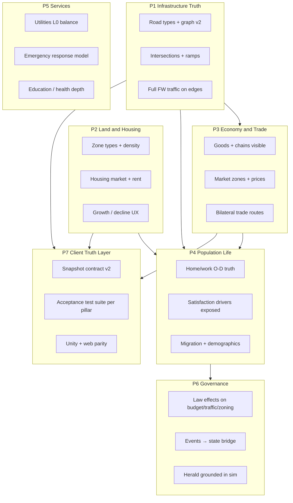

# CityMajor — Simulation Cathedral Program

**Status:** Active engineering program  
**Date:** 2026-08-10  
**Branch:** `feat/cathedral-program-2026-08-10`  
**Linear project:** CityMajor Sim Cathedral (create) · parent initiative: [SB-3708](https://linear.app/softblaze/issue/SB-3708)  
**OpenSpec:** [`openspec/specs/`](../../openspec/specs/) · first change: [`001-road-tier-and-graph-v2`](../../openspec/changes/001-road-tier-and-graph-v2/)

**Related Tier 0/1 docs:** [`SIMULATION_ARCHITECTURE.md`](./SIMULATION_ARCHITECTURE.md) · [`SIM_FOUNDATION_CHARTER.md`](./SIM_FOUNDATION_CHARTER.md) · [`CITY_ECOSYSTEM_VISION.md`](./CITY_ECOSYSTEM_VISION.md) · [`SIM_V1_GAP_MATRIX.md`](./SIM_V1_GAP_MATRIX.md)  
**Domain specs:** [`AGENT_03_ECONOMY.md`](./AGENT_03_ECONOMY.md) · [`AGENT_04_TRANSPORT.md`](./AGENT_04_TRANSPORT.md) · [`AGENT_05_ZONING_BUILDINGS.md`](./AGENT_05_ZONING_BUILDINGS.md) · [`AGENT_06_SERVICES.md`](./AGENT_06_SERVICES.md) · [`AGENT_07_POLITICS.md`](./AGENT_07_POLITICS.md)

---

## 1. Goal

Close the gap between **Tier 1 architecture docs** and the **shipped player experience** at **v1 scale**:

| Parameter | Value |
|-----------|-------|
| Map | 256×256 tiles |
| Households | ~10,000 |
| Buildings | ~5,000 instanced |
| Era arc | Frontier → Industrial (Unity: Modern era subset) |
| FPS target | ≥30 integrated GPU |

The sim **engines** (~9K LOC under `Forge.Game/Simulation/`) are ahead of most indie city builders. The Cathedral program makes that depth **visible, testable, and truthful** for players — not a rewrite.

**Non-goals:** Photoreal rendering, skeletal NPCs, multiplayer (v2 project), 1M-tile open world (Tier 2).

---

## 2. Honest completion state (architecture vs product)

| Domain | Engine / sim | Player-facing | Notes |
|--------|--------------|---------------|-------|
| **Infrastructure** | ~25% | ~25% | Tile paint + lite FW; no road tiers in sim; graph edges all `level=1` |
| **Housing / Zoning** | ~35% | ~35% | R/C/I + 7 web tiers; spec has A/O/P, density, affordability — mostly docs |
| **Economy** | ~75% | ~40% | Leontief + RCI + goods run; player sees budget/RCI strips, not full goods story |
| **Population** | ~60% | ~40% | 10K pool, satisfaction/employment live; L2 sample only, no housing market |
| **Services** | ~30% | ~25% | Coverage maps; `MISSING_SYSTEMS` depth (hydrants, EMS curves) not built |
| **Governance** | ~40% | ~30% | Approval live; law effects shallow vs `POLITICAL_LAW_SYSTEM.md` |
| **Client export** | ~50% | ~50% | Unity ahead of web; many snapshot fields don't drive UI |

**Read:** Beat Cities: Skylines on **economy/society/household depth** if exposed. On **roads/topology** — not yet; P1 required first.

---

## 3. Document tier hierarchy

```text
TIER 0 — Ship contracts (change rarely)
  UNITY_V1_SCOPE.md          ← what Steam EA must ship
  SIM_FOUNDATION_CHARTER.md  ← sim foundation program (WP-A–E complete)
  WASM_SIM_BRIDGE.md         ← snapshot contract
  CATHEDRAL_PROGRAM.md       ← THIS DOC — post-foundation depth program

TIER 1 — Domain architecture (target behavior)
  SIMULATION_ARCHITECTURE.md ← macro sim truth
  AGENT_03_ECONOMY.md … AGENT_07_POLITICS.md
  AGENT_04_TRANSPORT.md, AGENT_05_ZONING_BUILDINGS.md
  DATA_BRIDGE.md (buildings.json ↔ TypeId ↔ GLTF)

TIER 2 — Cathedral content (post-EA / optional depth)
  MISSING_SYSTEMS.md, EXPANDED_ZONES_EVENTS_SPORTS.md
  OPEN_WORLD_SCALE_PROPOSAL.md, GLOBAL_CITY_ARCHETYPES.md

SUPERSEDED — banner only, no new work
  MASTER_DEVELOPMENT_PLAN, AGENT_09 pixel, TECH_STACK Godot, WEB_V1 as primary ship
```

---

## 4. Seven pillars (P1–P7)

### 4.0 Milestone status (Sprint 1 complete)

| Milestone | Status | Notes |
|-----------|--------|-------|
| **P1.1**–**P1.6** | ✅ Done | Road tiers, graph v2, bridge/tunnel, ramps, toolbar UX, snapshot export — OpenSpec `001-road-tier-and-graph-v2` |
| **P2.1** | ✅ Done | Extended zone palette (office, mixed, park, ag) — `a990636` |
| **P2.2**–**P2.5** | ✅ Done | Density brush, rent model, Herald housing triggers, vacancy/rent burden snapshot |
| **P3.1** | ✅ Done | Goods panel shortages/surpluses + prices in HUD |
| **P3.2** | ✅ Done | Market zone partition prices export — `45d8186` |
| **P3.3**–**P3.4** | 🔲 Sprint 2 | Market-zone pricing depth, friction UI |
| **P4.1** | ✅ Done | Home/work building O-D for traffic lite — `99a6547` |
| **P4.2** | ✅ Done | Frank-Wolfe + graph commute → satisfaction — `76db8bf` / `f72dd3d` |
| **P7.2** (partial) | ✅ Test isolation | SimHost collection serialize (`49edba1`); unskip/flaky gate still open |

**Sprint 2 plan:** [`CATHEDRAL_SPRINT2.md`](./CATHEDRAL_SPRINT2.md)



### P1 — Infrastructure Truth *(blocks everything traffic-related)*

| Milestone | Deliverable | Spec ref | Acceptance |
|-----------|-------------|----------|------------|
| **P1.1** ✅ | `PlaceRoad(x,y,tier,flags)` + tier in `RoadFlags` | `TileData`, `AGENT_04` | Web toolbar tier changes sim capacity |
| **P1.2** ✅ | `RoadGraphBuilder` v2: segment between intersections, not per-tile nodes | `SIMULATION_ARCHITECTURE` §4 | 4-way vs T-junction typed; capacity from tier table |
| **P1.3** ✅ | One-way, bridge, tunnel flags affect cost/capacity | RoadFlags bits 6–7 | Bridge over water works in graph |
| **P1.4** ✅ | Highway on/off ramp nodes | `RoadNode.NodeType` | Ramp-only highway access; no illegal merges |
| **P1.5** ✅ | Full `TrafficSystem` default on Unity; lite on WASM | `TrafficSystem.cs` | Home→work O-D; BPR on typed edges |
| **P1.6** ✅ | Export `edgeVolumes[]`, `travelTimes[]` to snapshot | `WASM_SIM_BRIDGE` | Vehicle speed ∝ congestion; overlay matches |

### P2 — Land, zoning & housing

| Milestone | Deliverable | Spec ref |
|-----------|-------------|----------|
| **P2.1** ✅ | Zone types: R-low/high, C, I, office, mixed, park, ag (modern-era subset) | `AGENT_05`, `EXPANDED_ZONES` |
| **P2.2** ✅ | Density brush (low/med/high) affects spawn tier + HH cap | `ZoneDensity` in `TileData` |
| **P2.3** ✅ | Housing market: rent = f(land value, supply, shortage); `rent_burden` per HH | `PopulationSystem`, events |
| **P2.4** ✅ | Affordability → migration + `housing_crisis` events | Herald + politics |
| **P2.5** ✅ | Construction states in UI (foundation → complete) | Partial in Unity |
| **P2.6** | Decline/abandonment when demand negative + pollution/crime | `AGENT_05` decline formula |

### P3 — Economy & trade

| Milestone | Deliverable | Spec ref |
|-----------|-------------|----------|
| **P3.1** ✅ | Goods panel: top shortages/surpluses, prices by good | `EconomySystem` |
| **P3.2** ✅ | Market zone partition prices export (snapshot) | `EconomySystem` / `45d8186` |
| **P3.3** | 8–16 market zones with partition pricing | `SIMULATION_ARCHITECTURE` §5 |
| **P3.4** | Inter-zone trade friction matrix visible | WP-E complete |
| **P3.5** | Bilateral trade routes (v2): partner city, contract, freight time | `TradeSystem`, SB-3728 |
| **P3.6** | Traffic delays → goods delivery latency → industrial throughput | Cross-pillar with P1 |

### P4 — Population & life

| Milestone | Deliverable |
|-----------|-------------|
| **P4.1** ✅ | Full home/work building IDs on all commuters (not gravity O-D) |
| **P4.2** ✅ | Commute time from graph → satisfaction (FW + edge travel times) |
| **P4.3** | Employment matching visible (unemployment by zone) |
| **P4.4** | L2 export at scale (top 50–100 HH) + pick on map |
| **P4.5** | Mode choice stub: car vs transit weight from `TransitPreference` |

### P5 — Services & emergencies

**Phase 5a (EA):** Utilities L0 balance, coverage overlays, response time = distance + traffic.  
**Phase 5b (post-EA):** Fire spread, hydrants, EMS survival curve from `MISSING_SYSTEMS.md`.

| Milestone | Deliverable |
|-----------|-------------|
| **P5.1** | Utilities L0 balance surfaced in HUD |
| **P5.2** | Emergency response time model (distance + traffic) |
| **P5.3** | Fire v1 (spread + hydrant coverage) |

### P6 — Governance

| Milestone | Deliverable |
|-----------|-------------|
| **P6.1** | Law toggles apply budget/traffic/spawn multipliers |
| **P6.2** | `ApplyEventEffectsToState` bridge (web + Unity) |
| **P6.3** | Herald buckets only fire when snapshot predicates true |
| **P6.4** | Economic Control Spectrum slider (SB-3729) — **v2**, not EA |

### P7 — Client truth layer

| Milestone | Deliverable |
|-----------|-------------|
| **P7.1** | `SIM_SNAPSHOT_V2.md` — fields, cadence, ownership |
| **P7.2** | Per-pillar characterization tests in `Forge.SimCore.Tests` |
| **P7.3** | `acceptance/` Playwright + Unity menu verifies |
| **P7.4** | Gap matrix auto-regenerated in CI (script diffs spec vs exports) |

---

## 5. 18-month phased roadmap

| Phase | Duration | Focus | Gate |
|-------|----------|-------|------|
| **Phase 0 — Ship floor** | 4–6 weeks | Unity EA prerequisites: Play sign-off, Steam App ID, GLTF import. **No new sim depth** except bugfixes | SB-4176 green |
| **Phase 1 — Infrastructure Truth** | Sprints 1–3 (~8 weeks) | P1.1 → P1.6 | Avenue vs highway changes congestion + Herald text |
| **Phase 2 — Land & economy visible** | Sprints 4–6 (~8 weeks) | P2.1–P2.4 + P3.1–P3.4 (parallel sim/UI lanes) | Goods panel + zone types playable |
| **Phase 3 — Population truth** | Sprints 7–8 (~6 weeks) | P4 + P6.1–P6.3 | Home/work traffic; citizen stories match sim |
| **Phase 4 — Services & cathedral content** | Sprints 9–12 (ongoing) | P5a → P5b; cherry-pick `MISSING_SYSTEMS` by impact | Coverage + emergency response visible |
| **Phase 5 — v2 gates** | After P1–P4 green | Economic Control Spectrum, bilateral trade, multiplayer | SB-3728/3729 unblocked |

---

## 6. Sprint cadence & acceptance rules

**Cadence:** 2-week sprints.

| Week | Ritual |
|------|--------|
| Mon W1 | Sprint planning — pick **2–3 milestones max** across pillars |
| Daily | Orchestrator merges lane worktrees ([`UNITY_ORCHESTRATION.md`](./UNITY_ORCHESTRATION.md)) |
| Fri W2 | Demo: run acceptance checklist for touched pillar |
| Fri W2 | Update `SIM_V1_GAP_MATRIX` + Linear project update |

**Rules:**

1. **One pillar primary per sprint** — others only if blocked.
2. Each milestone ships with **characterization test** (P7.2) before merge.
3. OpenSpec change folder required for any cross-surface sim change (SimCore + client).
4. No Tier 2 content (`MISSING_SYSTEMS` depth) until Phase 4 unless explicitly sprint-scoped.

---

## 7. Linear project structure

### Initiative

**CityMajor — Simulation Cathedral** (sibling to SB-3708 canonical roadmap)

### Projects

| Project | Purpose |
|---------|---------|
| CityMajor Unity v1 — Modern Era Desktop | Ship EA shell (existing) |
| **CityMajor Sim Cathedral** | **NEW** — P1–P7 epics |
| CityMajor v1.5 — Depth & Retention | Merge cathedral milestones into sprints |
| CityMajor v2 — Multiplayer & Trade | Gate on Cathedral P3.5 + auth |
| CityMajor Web v1 | Maintenance parity — P7.3 web slice only |

### Labels

`pillar:infrastructure` · `pillar:housing` · `pillar:economy` · `pillar:population` · `pillar:services` · `pillar:governance` · `pillar:client` · `sim-core` · `unity` · `web` · `acceptance-test`

### Issue templates

Bulk create from [`docs/linear/CATHEDRAL_ISSUES.md`](../linear/CATHEDRAL_ISSUES.md).

---

## 8. OpenSpec workflow

OpenSpec **complements Linear** — it does not replace prioritization or cycles.

| Tool | Role |
|------|------|
| **Linear** | Prioritization, cycles, ownership, ship dates |
| **Tier 0/1 docs** | Stable architecture narrative |
| **OpenSpec** | Per-change **delta requirements** — review before code |

### Layout

```text
openspec/
  config.yaml
  specs/                    # implemented truth (7 domain files)
    infrastructure.md
    zoning-housing.md
    economy-trade.md
    population.md
    services.md
    governance.md
    snapshot-contract.md
  changes/
    001-road-tier-and-graph-v2/
      proposal.md
      design.md
      tasks.md
      specs/infrastructure.delta.md
```

**Workflow:** Each sprint milestone = one OpenSpec change → PR → archive merges delta into `openspec/specs/`.

**Do not:** Import all 66 design docs; replace `UNITY_V1_SCOPE`; use OpenSpec for Meshy batch tracking (Linear SB-3730).

---

## 9. Relationship to Simulation Foundation Charter

[`SIM_FOUNDATION_CHARTER.md`](./SIM_FOUNDATION_CHARTER.md) (WP-A through WP-E) established sim engines, characterization tests, and v1-scale tick budgets. **Cathedral is the successor program** for player-facing depth and infrastructure truth post WP-E.

---

## 10. Progress log

| Date | Note |
|------|------|
| 2026-08-10 | Program charter + OpenSpec scaffold + Linear issue templates |
| 2026-08-10 | **Sprint 1 complete** — P1.1–P1.6, P2.2–P2.5, P3.1 merged to integration (`b61c4b1`) |
| 2026-08-10 | **Sprint 2 planned** — P2.1 palette, P3.2–P3.4 economy depth, P4.1–P4.2 population truth, flaky-test gate ([`CATHEDRAL_SPRINT2.md`](./CATHEDRAL_SPRINT2.md)) |
| 2026-08-10 | **Sprint 2 mid-sync** — P2.1 (`a990636`), P3.2 (`45d8186`), P4.1 O-D (`99a6547`), P4.2 FW+commute sat (`76db8bf`/`f72dd3d`), test isolation (`49edba1`); remaining P3.3–P3.4 + P7.2 unskip gate |
