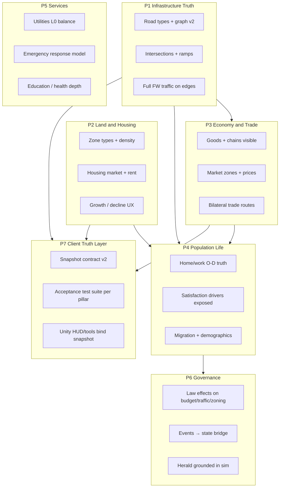

# CityMajor — Simulation Cathedral Program

**Status:** Active engineering program  
**Date:** 2026-08-10  
**Branch:** `feat/unity-port-plan-2026-07-12` (integration)  
**Platform (locked):** **Unity 6 Editor + desktop/Steam player builds** — this is the product  
**Linear project:** CityMajor Sim Cathedral · parent initiative: [SB-3708](https://linear.app/softblaze/issue/SB-3708)  
**OpenSpec:** [`openspec/specs/`](../../openspec/specs/) · first change archived: [`001-road-tier-and-graph-v2`](../../openspec/changes/archive/2026-08-10-001-road-tier-and-graph-v2/)

**Related Tier 0/1 docs:** [`UNITY_V1_SCOPE.md`](./UNITY_V1_SCOPE.md) · [`UNITY_ORCHESTRATION.md`](./UNITY_ORCHESTRATION.md) · [`SIMULATION_ARCHITECTURE.md`](./SIMULATION_ARCHITECTURE.md) · [`SIM_FOUNDATION_CHARTER.md`](./SIM_FOUNDATION_CHARTER.md) · [`CITY_ECOSYSTEM_VISION.md`](./CITY_ECOSYSTEM_VISION.md) · [`SIM_V1_GAP_MATRIX.md`](./SIM_V1_GAP_MATRIX.md)  
**Domain specs:** [`AGENT_03_ECONOMY.md`](./AGENT_03_ECONOMY.md) · [`AGENT_04_TRANSPORT.md`](./AGENT_04_TRANSPORT.md) · [`AGENT_05_ZONING_BUILDINGS.md`](./AGENT_05_ZONING_BUILDINGS.md) · [`AGENT_06_SERVICES.md`](./AGENT_06_SERVICES.md) · [`AGENT_07_POLITICS.md`](./AGENT_07_POLITICS.md)

---

## 0. Platform mandate (Unity-first)

| Surface | Role |
|---------|------|
| **Unity Editor + player builds** | **Shipped product** — all player UX, HUD, tools, overlays, Steam |
| **`web/` Next.js + R3F** | **Archival / spike only** — not a ship target; no new player features |
| **WASM (`Forge.SimWasm`)** | **Optional sim validation harness** — characterization / CI / smoke against the same `Forge.SimCore` snapshot contract |

**Player experience is Unity.** Cathedral milestones that touch UI, tools, overlays, or Play acceptance land in `unity/CityMajor.Unity/` first. Web R3F panels that already exist may mirror snapshot fields for harness debugging, but they do **not** define product parity.

**Orchestration:** [`UNITY_ORCHESTRATION.md`](./UNITY_ORCHESTRATION.md) is the **canonical** integration tracker (lanes, merge protocol, bootstrap inventory, Play gate).

**Next sprint:** [`CATHEDRAL_UNITY_SPRINT.md`](./CATHEDRAL_UNITY_SPRINT.md) — Unity UI/HUD + tools parity.

---

## 1. Goal

Close the gap between **Tier 1 architecture docs** and the **shipped Unity player experience** at **v1 scale**:

| Parameter | Value |
|-----------|-------|
| Map | 256×256 tiles |
| Households | ~10,000 |
| Buildings | ~5,000 instanced |
| Era arc | **Modern** (Unity v1); Frontier→Industrial content deferred / archival web kits |
| FPS target | ≥30 integrated GPU (Editor + player builds) |
| Ship surface | Unity 6 URP desktop (macOS / Windows / Linux) + Steam |

The sim **engines** (~9K LOC under `Forge.Game/Simulation/` / `Forge.SimCore`) are ahead of most indie city builders. The Cathedral program makes that depth **visible, testable, and truthful** in the Unity client — not a rewrite, and not a browser ship.

**Non-goals:** Photoreal rendering, skeletal NPCs, multiplayer (v2 project), 1M-tile open world (Tier 2), shipping the web R3F client.

---

## 2. Honest completion state (architecture vs product)

| Domain | Engine / sim | Player-facing | Notes |
|--------|--------------|---------------|-------|
| **Infrastructure** | ~25% | ~25% | Tile paint + lite FW; no road tiers in sim; graph edges all `level=1` |
| **Housing / Zoning** | ~35% | ~35% | R/C/I + 7 web tiers; spec has A/O/P, density, affordability — mostly docs |
| **Economy** | ~75% | ~40% | Leontief + RCI + goods run; player sees budget/RCI strips, not full goods story |
| **Population** | ~60% | ~40% | 10K pool, satisfaction/employment live; L2 sample only, no housing market |
| **Services** | ~30% | ~25% | Coverage maps; `MISSING_SYSTEMS` depth (hydrants, EMS curves) not built |
| **Governance** | ~40% | ~30% | Approval live; law effects shallow vs `POLITICAL_LAW_SYSTEM.md` |
| **Client export** | ~55% | ~45% | Unity is the product UI; many snapshot fields still lack Unity HUD/overlay binding |

**Read:** Beat Cities: Skylines on **economy/society/household depth** if exposed in Unity. On **roads/topology** — P1 sim landed; Unity tool/overlay polish is the remaining player gap (see Unity sprint).

---

## 3. Document tier hierarchy

```text
TIER 0 — Ship contracts (change rarely)
  UNITY_V1_SCOPE.md          ← what Steam EA must ship (canonical platform)
  UNITY_ORCHESTRATION.md     ← canonical Unity integration + lane protocol
  SIM_FOUNDATION_CHARTER.md  ← sim foundation program (WP-A–E complete)
  WASM_SIM_BRIDGE.md         ← snapshot contract (harness / shared fields)
  CATHEDRAL_PROGRAM.md       ← THIS DOC — post-foundation depth program

TIER 1 — Domain architecture (target behavior)
  SIMULATION_ARCHITECTURE.md ← macro sim truth
  AGENT_03_ECONOMY.md … AGENT_07_POLITICS.md
  AGENT_04_TRANSPORT.md, AGENT_05_ZONING_BUILDINGS.md
  DATA_BRIDGE.md (buildings.json ↔ TypeId ↔ GLTF)

TIER 2 — Cathedral content (post-EA / optional depth)
  MISSING_SYSTEMS.md, EXPANDED_ZONES_EVENTS_SPORTS.md
  OPEN_WORLD_SCALE_PROPOSAL.md, GLOBAL_CITY_ARCHETYPES.md

SUPERSEDED / ARCHIVAL — banner only, no player-ship work
  MASTER_DEVELOPMENT_PLAN, AGENT_09 pixel, TECH_STACK Godot
  WEB_V1_SCOPE as primary ship · web R3F client as product surface
```

---

## 4. Seven pillars (P1–P7)

### 4.0 Milestone status (Sprint 1 complete)

| Milestone | Status | Notes |
|-----------|--------|-------|
| **P1.1**–**P1.6** | ✅ Done | Road tiers, graph v2, bridge/tunnel, ramps, toolbar UX, snapshot export — OpenSpec `001` archived |
| **P1.5 UX** | ✅ Done | Dedicated ramp paint + bridge/tunnel toolbar toggle — `6084fad` / `b34942a` / `c8f9e52` |
| **P2.1** | ✅ Done | Extended zone palette (office, mixed, park, ag) — `a990636` |
| **P2.2**–**P2.5** | ✅ Done | Density brush, rent model, Herald housing triggers, vacancy/rent burden snapshot |
| **P2.6** | ✅ Done | Decline/abandonment export + Unity abandoned tint / Cathedral HUD |
| **P3.1** | ✅ Done | Goods panel shortages/surpluses + prices in HUD |
| **P3.2** | ✅ Done | Partition prices export + production-chain HUD — `45d8186` / `746780c` |
| **P3.3** | ✅ Done | Market-zone pricing depth (1→4→9→16 + Unity partition spread HUD) |
| **P3.4** | ✅ Done | Inter-zone friction overlay — `a9e7878` · Unity `F` overlay |
| **P3.6** | ✅ Done | Traffic → goods delivery lag + industrial throughput · Unity Delivery % |
| **P4.1** | ✅ Done | Home/work building O-D for traffic lite — `99a6547` · O-D HUD `ccf7f22` |
| **P4.2** | ✅ Done | Frank-Wolfe + graph commute → satisfaction — `76db8bf` / `f72dd3d` |
| **P4.4** | ✅ Done | L2 export at scale (top 100 HH) + map pick — job / commute / rent burden |
| **P4.5** | ✅ Done | Mode-choice stub (simple MNL) — `571352a` · mode-share HUD `370e944` |
| **P5 stub** | ✅ Done | Politics foundation stub — approval characterization — `fb64bd9` |
| **P5.1** | ✅ Done | Utilities L0 coverage export + characterization — `ae635b0` / SB-4987 |
| **P5.2** | ✅ Done | Emergency response time (graph + BPR) — `06977a9` / SB-4242 |
| **P5.3** | ✅ Done | Fire v1 (spread + hydrant coverage) |
| **P5.4** | ✅ Done | EMS survival curve from response minutes |
| **Tier-2 hosp** | ✅ Done | Hospital capacity — nearest free beds + EMS chain + ResourcesHud Hosp |
| **Tier-2 wildfire** | ✅ Done | Wildfire / arson rings — drought fuel spread + high-crime cluster + Fire HUD |
| **Tier-2 fire rating** | ✅ Done | Lookout / aerial / fire safety rating → insurance premium + Fire HUD |
| **Tier-2 education** | ✅ Done | HH education progression under schools + Edu HUD 🎓 |
| **Tier-2 park amenity** | ✅ Done | Park zones boost health/exercise + Park HUD 🌳 |
| **Tier-2 health→P4** | ✅ Done | `HealthSatisfaction` → satisfaction / immigration / emigration |
| **Tier-2 health prog** | ✅ Done | Hospital → HH `HealthSatisfaction` over time + `HealthCoverageFraction` + Hosp HUD |
| **Tier-2 tourism** | ✅ Done | Parks/landmarks feed `TourismIncome` (not only pop×happiness) + Budget HUD |
| **P6.1**–**P6.3** / **P5.6** | ✅ Done | Law spawn mults · Event*Mult bridge · Herald predicates · council seats |
| **P7.5** | ✅ Done | Unity Cathedral HUD Event*Mult + WASM DTO export (Sprint 3 parity close) |
| **Client overlays** | ✅ Done | Congestion heatmap `c8827bf` · O-D sample HUD `ccf7f22` · mode share `370e944` · unemployment HUD `e70ed78` |
| **P7.2** | ✅ Done | 0 Cathedral `Skip=` gate — `817e968` / SB-4986 · isolation `49edba1` / `b4be623` |
| **Harness polish** | ✅ Done | Smoke wait WASM `0ecc0ba` · E-key economy toggle `5205201` · perf median gate `6c1f077` |

**Sprint 2 plan (closed):** [`CATHEDRAL_SPRINT2.md`](./CATHEDRAL_SPRINT2.md) — P3.3 closed  
**Sprint 3 plan (active next):** [`CATHEDRAL_UNITY_SPRINT.md`](./CATHEDRAL_UNITY_SPRINT.md) — Unity UI/HUD + tools parity



### P1 — Infrastructure Truth *(blocks everything traffic-related)*

| Milestone | Deliverable | Spec ref | Acceptance |
|-----------|-------------|----------|------------|
| **P1.1** ✅ | `PlaceRoad(x,y,tier,flags)` + tier in `RoadFlags` | `TileData`, `AGENT_04` | Unity road tool tier changes sim capacity |
| **P1.2** ✅ | `RoadGraphBuilder` v2: segment between intersections, not per-tile nodes | `SIMULATION_ARCHITECTURE` §4 | 4-way vs T-junction typed; capacity from tier table |
| **P1.3** ✅ | One-way, bridge, tunnel flags affect cost/capacity | RoadFlags bits 6–7 | Bridge over water works in graph |
| **P1.4** ✅ | Highway on/off ramp nodes | `RoadNode.NodeType` | Ramp-only highway access; no illegal merges |
| **P1.5** ✅ | Full `TrafficSystem` default on Unity; lite on WASM harness; ramp + bridge/tunnel paint UX | `TrafficSystem.cs` + Unity `RoadPaintTool` | Home→work O-D; BPR on typed edges; ramp/bridge paint |
| **P1.6** ✅ | Export `edgeVolumes[]`, `travelTimes[]` to snapshot | `WASM_SIM_BRIDGE` | Vehicle speed ∝ congestion; overlay matches |

### P2 — Land, zoning & housing

| Milestone | Deliverable | Spec ref |
|-----------|-------------|----------|
| **P2.1** ✅ | Zone types: R-low/high, C, I, office, mixed, park, ag (modern-era subset) | `AGENT_05`, `EXPANDED_ZONES` |
| **P2.2** ✅ | Density brush (low/med/high) affects spawn tier + HH cap | `ZoneDensity` in `TileData` |
| **P2.3** ✅ | Housing market: rent = f(land value, supply, shortage); `rent_burden` per HH | `PopulationSystem`, events |
| **P2.4** ✅ | Affordability → migration + `housing_crisis` events | Herald + politics |
| **P2.5** ✅ | Construction states in UI (foundation → complete) | Partial in Unity |
| **P2.6** ✅ | Decline/abandonment when demand negative + pollution/crime | Snapshot `AbandonedBuildingCount` + Unity abandoned tint / Cathedral HUD |

### P3 — Economy & trade

| Milestone | Deliverable | Spec ref |
|-----------|-------------|----------|
| **P3.1** ✅ | Goods panel: top shortages/surpluses, prices by good | `EconomySystem` |
| **P3.2** ✅ | Partition prices export + production-chain HUD | `EconomySystem` / `45d8186` / `746780c` |
| **P3.3** ✅ | 1→4→9→16 market zones + partition price spread HUD | `SIMULATION_ARCHITECTURE` §5 · Unity Economy `[E]` |
| **P3.4** ✅ | Inter-zone trade friction matrix visible | WP-E / `a9e7878` |
| **P3.5** ✅ | Bilateral trade routes (v2 stretch): partner city, contract, freight time | `TradeSystem`, SB-3728 — freight + snapshot + Unity Trade create/cancel `[Y]` (regional map deferred) |
| **P3.6** ✅ | Traffic delays → goods delivery latency → industrial throughput | Domain P3.5 — `EffectiveTradeFriction` + `MeanGoodsDeliveryDelay` + Unity Delivery % |

### P4 — Population & life

| Milestone | Deliverable |
|-----------|-------------|
| **P4.1** ✅ | Full home/work building IDs on all commuters (not gravity O-D); O-D HUD sample |
| **P4.2** ✅ | Commute time from graph → satisfaction (FW + edge travel times) |
| **P4.3** ✅ | Unemployment + job vacancy HUD (city-level export) — `e70ed78` / web `46a08e1` |
| **P4.4** ✅ | L2 export at scale (top 100 HH) + pick on map — job / commute / rent burden |
| **P4.5** ✅ | Mode choice stub + mode-share HUD — `571352a` / `370e944` |

### P5 — Services & emergencies

**Phase 5a (EA):** Utilities L0 balance, coverage overlays, response time = distance + traffic.  
**Phase 5b:** Fire spread, hydrants (P5.3 ✅), EMS survival curve (P5.4 ✅), hospital capacity Tier-2 ✅, wildfire / arson rings Tier-2 ✅, aerial / lookout / fire rating Tier-2 ✅, education depth Tier-2 ✅, park amenity parity Tier-2 ✅, health → P4 satisfaction/migration Tier-2 ✅, hospital → HH health progression Tier-2 ✅, tourism attractions stub Tier-2 ✅.

| Milestone | Deliverable |
|-----------|-------------|
| **P5 stub** ✅ | Politics foundation stub (approval characterization) — see [`CATHEDRAL_P5_POLITICS.md`](./CATHEDRAL_P5_POLITICS.md) / `fb64bd9` |
| **P5.1** ✅ | Utilities L0 balance + coverage export characterization — [`CATHEDRAL_P5_SERVICES.md`](./CATHEDRAL_P5_SERVICES.md) / `ae635b0` / SB-4987 |
| **P5.2** ✅ | Emergency response time model (distance + traffic / BPR) — `EmergencyResponseTime` / `06977a9` / SB-4242 |
| **P5.3** ✅ | Fire v1 (spread + hydrant coverage) — `FireResponse` + ResourcesHud Fire line |
| **P5.4** ✅ | EMS survival curve — `EmsSurvival` + `MeanEmsSurvivalRate` + ResourcesHud EMS % |
| **Tier-2 hosp** ✅ | Hospital capacity — `HospitalCapacity` nearest free beds + EMS transport chain + ResourcesHud Hosp |
| **Tier-2 wildfire** ✅ | Wildfire / arson rings — `WildfireArson` + Fire HUD 🌲/🕵️ |
| **Tier-2 fire rating** ✅ | Lookout / aerial / `FireSafetyRating` → insurance premium + Fire HUD 🔭/✈️/⭐ |
| **Tier-2 education** ✅ | HH education progression under schools — `EducationProgression` + Edu HUD 🎓 |
| **Tier-2 park amenity** ✅ | Painted park zones + buildings raise health/exercise — `ParkAmenity` + Park HUD 🌳 |
| **Tier-2 health→P4** ✅ | `HealthSatisfaction` weight in satisfaction + mean-health immigration mod → emigration via Happiness |
| **Tier-2 health prog** ✅ | Hospital → HH health — `HealthProgression` + `HealthCoverageFraction` + Hosp HUD ❤ / cov% |
| **Tier-2 tourism** ✅ | Parks/landmarks → `TourismIncome` — `TourismAttractions` + Budget HUD tourism row |

### P6 — Governance

| Milestone | Deliverable |
|-----------|-------------|
| **P6.1** ✅ | Law toggles apply budget/traffic/spawn multipliers — zone R/C/I spawn hooks + Law panel mults |
| **P6.2** ✅ | `ApplyEventEffectsToState` bridge — city-wide Event*Mult (tax/immigration/commerce/productivity/research/spawn) + Herald snake_case effects; `EventEffectsTests` |
| **P6.3** ✅ | Herald buckets only fire when snapshot predicates true — P5.5 `0452f88` |
| **P6.4** | Economic Control Spectrum slider (SB-3729) — **v2**, not EA |
| **P5.6** ✅ | Council seats export on WASM status/snapshot — `ae15498` |

### P7 — Client truth layer *(Unity = product UI)*

| Milestone | Deliverable |
|-----------|-------------|
| **P7.1** ✅ | `SIM_SNAPSHOT_V2.md` — fields, cadence, ownership ([`SIM_SNAPSHOT_V2.md`](./SIM_SNAPSHOT_V2.md), tip `8f57614`) |
| **P7.2** ✅ | Per-pillar characterization tests — 0 Cathedral `Skip=` (`817e968` / SB-4986) |
| **P7.3** | Unity Play menu verifies ([`UNITY_PLAY_CHECKLIST.md`](./UNITY_PLAY_CHECKLIST.md)); optional WASM smoke as harness only |
| **P7.4** ✅ | Gap matrix CI — `scripts/verify-sim-snapshot-v2.py` asserts `SIM_SNAPSHOT_V2.md` §4 vs `SimSnapshot` / `SimSnapshotDto` / `CitySimState` (wired in `unity-simcore.yml`) |
| **P7.5** ✅ | Unity HUD/tools parity for Cathedral snapshot fields — Event*Mult on Cathedral HUD + WASM DTO (Sprint 3 — [`CATHEDRAL_UNITY_SPRINT.md`](./CATHEDRAL_UNITY_SPRINT.md)) |

---

## 5. 18-month phased roadmap

| Phase | Duration | Focus | Gate |
|-------|----------|-------|------|
| **Phase 0 — Ship floor** | 4–6 weeks | Unity EA prerequisites: Play sign-off, Steam App ID, GLTF import. **No new sim depth** except bugfixes | SB-4176 green |
| **Phase 1 — Infrastructure Truth** | Sprints 1–3 (~8 weeks) | P1.1 → P1.6 | Avenue vs highway changes congestion + Herald text |
| **Phase 2 — Land & economy visible** | Sprints 4–6 (~8 weeks) | P2.1–P2.4 + P3.1–P3.4 (parallel sim/UI lanes) | Goods panel + zone types playable |
| **Phase 3 — Population truth** | Sprints 7–8 (~6 weeks) | P4 + P6.1–P6.3 | Home/work traffic; citizen stories match sim |
| **Phase 4 — Services & cathedral content** | Sprints 9–12 (ongoing) | P5a → P5b; cherry-pick `MISSING_SYSTEMS` by impact | Coverage + emergency response visible |
| **Phase 5 — v2 gates** | After P1–P4 green | Economic Control Spectrum, bilateral trade, multiplayer | SB-3728/3729 unblocked |

---

## 6. Sprint cadence & acceptance rules

**Cadence:** 2-week sprints.

| Week | Ritual |
|------|--------|
| Mon W1 | Sprint planning — pick **2–3 milestones max** across pillars |
| Daily | Orchestrator merges lane worktrees ([`UNITY_ORCHESTRATION.md`](./UNITY_ORCHESTRATION.md)) |
| Fri W2 | Demo: run acceptance checklist for touched pillar |
| Fri W2 | Update `SIM_V1_GAP_MATRIX` + Linear project update |

**Rules:**

1. **One pillar primary per sprint** — others only if blocked.
2. Each milestone ships with **characterization test** (P7.2) before merge.
3. OpenSpec change folder required for any cross-surface sim change (SimCore + client).
4. No Tier 2 content (`MISSING_SYSTEMS` depth) until Phase 4 unless explicitly sprint-scoped.

---

## 7. Linear project structure

### Initiative

**CityMajor — Simulation Cathedral** (sibling to SB-3708 canonical roadmap)

### Projects

| Project | Purpose |
|---------|---------|
| CityMajor Unity v1 — Modern Era Desktop | **Ship product** — EA shell + Steam |
| **CityMajor Sim Cathedral** | P1–P7 epics (sim depth + Unity truth layer) |
| CityMajor v1.5 — Depth & Retention | Merge cathedral milestones into Unity sprints |
| CityMajor v2 — Multiplayer & Trade | Gate on Cathedral P3.5 + auth |
| CityMajor Web v1 | **Archived** — no ship; harness / historical R3F spike only |

### Labels

`pillar:infrastructure` · `pillar:housing` · `pillar:economy` · `pillar:population` · `pillar:services` · `pillar:governance` · `pillar:client` · `sim-core` · `unity` · `acceptance-test` · `harness` (WASM/web validation only)

### Issue templates

Bulk create from [`docs/linear/CATHEDRAL_ISSUES.md`](../linear/CATHEDRAL_ISSUES.md).

---

## 8. OpenSpec workflow

OpenSpec **complements Linear** — it does not replace prioritization or cycles.

| Tool | Role |
|------|------|
| **Linear** | Prioritization, cycles, ownership, ship dates |
| **Tier 0/1 docs** | Stable architecture narrative |
| **OpenSpec** | Per-change **delta requirements** — review before code |

### Layout

```text
openspec/
  config.yaml
  specs/                    # implemented truth (7 domain files)
    infrastructure.md       # P1.1–P1.6 requirements (merged from 001)
    zoning-housing.md
    economy-trade.md
    population.md
    services.md
    governance.md
    snapshot-contract.md
  changes/
    archive/
      2026-08-10-001-road-tier-and-graph-v2/   # P1.1–P1.6 — archived
```

**Workflow:** Each sprint milestone = one OpenSpec change → PR → archive merges delta into `openspec/specs/`.

**Do not:** Import all 66 design docs; replace `UNITY_V1_SCOPE`; use OpenSpec for Meshy batch tracking (Linear SB-3730).

---

## 9. Relationship to Simulation Foundation Charter

[`SIM_FOUNDATION_CHARTER.md`](./SIM_FOUNDATION_CHARTER.md) (WP-A through WP-E) established sim engines, characterization tests, and v1-scale tick budgets. **Cathedral is the successor program** for player-facing depth and infrastructure truth post WP-E.

---

## 10. Progress log

| Date | Note |
|------|------|
| 2026-08-10 | Program charter + OpenSpec scaffold + Linear issue templates |
| 2026-08-10 | **Sprint 1 complete** — P1.1–P1.6, P2.2–P2.5, P3.1 merged to integration (`b61c4b1`) |
| 2026-08-10 | **Sprint 2 planned** — P2.1 palette, P3.2–P3.4 economy depth, P4.1–P4.2 population truth, flaky-test gate ([`CATHEDRAL_SPRINT2.md`](./CATHEDRAL_SPRINT2.md)) |
| 2026-08-10 | **Sprint 2 mid-sync** — P2.1 (`a990636`), P3.2 (`45d8186`), P4.1 O-D (`99a6547`), P4.2 FW+commute sat (`76db8bf`/`f72dd3d`), test isolation (`49edba1`); remaining P3.3–P3.4 + P7.2 unskip gate |
| 2026-08-10 | **Sprint 2 wave-2 sync** — P3.2 chain HUD (`746780c`), P3.4 friction (`a9e7878`), P1.5 ramp/bridge UI (`6084fad`/`b34942a`), congestion heatmap (`c8827bf`), O-D HUD (`ccf7f22`), mode choice (`571352a`), SimplexNoise (`b4be623`), P5 politics stub (`fb64bd9`); OpenSpec `001` archived; remaining **P3.3** + P7.2 unskip gate |
| 2026-08-10 | **Unity-first mandate locked** — player experience = Unity Editor + builds; web R3F archival/spike; WASM optional harness; next sprint [`CATHEDRAL_UNITY_SPRINT.md`](./CATHEDRAL_UNITY_SPRINT.md); orchestration canonical [`UNITY_ORCHESTRATION.md`](./UNITY_ORCHESTRATION.md) |
| 2026-08-10 | **Sprint 2 wave-3 sync** @ `06977a9` — P5.2 EMS response (`06977a9`), P5.5/P5.6 (`0452f88`/`ae15498`), P5.1 utilities char (`ae635b0`), P7.2 0-skip (`817e968`/SB-4986), mode-share HUD (`370e944`), unemployment HUD (`e70ed78`), smoke WASM wait (`0ecc0ba`), E-key fix (`5205201`), perf median gate (`6c1f077`); remaining **P3.3** |
| 2026-08-11 | **P3.3 closed** — zone scale 1→4→9→16 + trade-shock characterization; Unity Economy/Cathedral partition spread HUD (`[E]`) |
| 2026-08-11 | **U3.4 landed** — Park zone byte 8 (T112) + density Med/High era+tech gates; `HasNearbyPark` reads painted park tiles |
| 2026-08-11 | **P2.6 landed** — `AbandonedBuildingCount` on snapshot; decline formula characterization; Unity abandoned mesh tint + Cathedral `Abandoned N` |
| 2026-08-11 | **P3.5 / PROGRAM P3.6 landed** — traffic delivery delay → `EffectiveTradeFriction` + industrial throughput; `MeanGoodsDeliveryDelay` + Unity Delivery % HUD |
| 2026-08-11 | **P4.4 landed** — L2 sample scaled to top 100 HH with job / commute / rent burden; Unity map pick → Citizen panel drill-down |
| 2026-08-11 | **P6.1 landed** — law→spawn R/C/I mults + Law panel; `LawEffectsTests` |
| 2026-08-11 | **P6.2 landed** — `ApplyEventEffectsToState` city-wide Event*Mult + Herald snake_case; `EventEffectsTests` |
| 2026-08-11 | **P7.5 landed** — Unity Cathedral HUD binds Event*Mult; WASM `SimSnapshotDto` Event*Mult export |
| 2026-08-11 | **P5.3 landed** — `FireResponse` hydrant coverage + spread; no-hydrant 2× response; ResourcesHud Fire line |
| 2026-08-11 | **P5.4 landed** — `EmsSurvival` response→survival curve; `MeanEmsSurvivalRate` snapshot + ResourcesHud EMS % |
| 2026-08-11 | **Tier-2 hospital capacity** — `HospitalCapacity` nearest free beds; EMS survival chain + transport; `HospitalBedOccupancyFraction` / `AvailableHospitalBeds` + ResourcesHud Hosp |
| 2026-08-11 | **P7.1 landed** — [`SIM_SNAPSHOT_V2.md`](./SIM_SNAPSHOT_V2.md) field/cadence/ownership matrix for engine · WASM DTO · Unity `CitySimState` |
| 2026-08-11 | **P7.4 landed** — `scripts/verify-sim-snapshot-v2.py` doc↔export gap check in `unity-simcore.yml` (SB-4264) |
| 2026-08-11 | **Save/load wave restore** — `ApplySnapshotDto` restores Event*Mult, delivery delay, abandoned recount, BuildingDto FireRisk/ServiceFlags (+ pool id preserve), L2 HH sample overlay; `CathedralSaveLoadTests` |
| 2026-08-11 | **Law\*Mult WASM DTO** — export + `ApplySnapshotDto` restore for traffic/construction/spawn Mults; closes SIM_SNAPSHOT_V2 §6 gap; `SnapshotRoundTrip_PreservesLawMults` |
| 2026-08-11 | **ActiveLawIds WASM DTO** — ordinance slug ids export + restore (deeper than Law\*Mult); `SnapshotRoundTrip_PreservesActiveLawIds` |
| 2026-08-11 | **ActiveOrdinances / NextElectionYear WASM DTO** — politics bitfield + election year export + restore; `SnapshotRoundTrip_PreservesActiveOrdinancesAndNextElectionYear` |
| 2026-08-11 | **BlackoutFraction / WaterShortageFraction WASM DTO** — rolling L0 utility shortages export + restore; `SnapshotRoundTrip_PreservesBlackoutAndWaterShortageFractions` |
| 2026-08-11 | **CulturalDna[] WASM DTO** — politics flavor vector export + restore; `SnapshotRoundTrip_PreservesCulturalDna` |
| 2026-08-11 | **TradeBalance / export-import WASM DTO** — TradeBalance + MonthlyExport/Import export + restore; `SnapshotRoundTrip_PreservesTradeBalance` |
| 2026-08-11 | **Commute O-D Unity parity** — `CitySimState.CommuteOdSample[]` + Cathedral HUD top pairs; closes SIM_SNAPSHOT_V2 §6 Commute O-D gap |
| 2026-08-11 | **Tier-2 wildfire / arson rings** — `WildfireArson` drought fuel spread + firebreaks + high-crime arson / ring flag; snapshot + ResourcesHud Fire 🌲/🕵️ |
| 2026-08-11 | **Tier-2 aerial / lookout / fire rating** — lookout spark cut + aerial suppress + `FireSafetyRating` / insurance premium; snapshot + Fire HUD 🔭/✈️/⭐ |
| 2026-08-11 | **WASM_SIM_BRIDGE / sim-types TS refresh** — tip `SimSnapshotDto` contract in `@citymajor/sim-types` + WASM_SIM_BRIDGE §6 + archival `sim-bridge.ts`; closes SIM_SNAPSHOT_V2 §6 #1 |
| 2026-08-11 | **Tier-2 education depth** — `EducationProgression` HH level-ups under school coverage; `MeanEducationLevel` / `EducationCoverageFraction` + research RP mult + Edu HUD 🎓 |
| 2026-08-11 | **Tier-2 park amenity parity** — `ParkAmenity` painted zones raise health/exercise (not only land value); `MeanParkAccess` / `ParkAccessFraction` / `MeanHealthSatisfaction` + Park HUD 🌳 |
| 2026-08-11 | **Tier-2 health → P4** — `HealthSatisfaction` feeds `CalculateSatisfaction` + mean-health immigration attractiveness; Park HUD notes migration coupling |
| 2026-08-11 | **Tier-2 hospital → HH health** — `HealthProgression` raises / decays `HealthSatisfaction` under hospital coverage; `HealthCoverageFraction` + Hosp HUD ❤ / cov% |
| 2026-08-11 | **Tier-2 tourism attractions** — `TourismAttractions` parks/landmarks feed `TourismIncome` (not only pop×happiness); Budget HUD + snapshot |
| 2026-08-11 | **P3.5 bilateral trade routes** — partner + contract + `FreightMonths`; SimHost keeps bilateral routes; snapshot + Unity Trade/Economy HUD |
| 2026-08-11 | **SB-3728 create/cancel bilateral** — `SimHost.CreateBilateralTradeRoute` / `CancelBilateralTradeRoute`; Unity Trade strip `[Y]` + toolbar; regional map still deferred |
