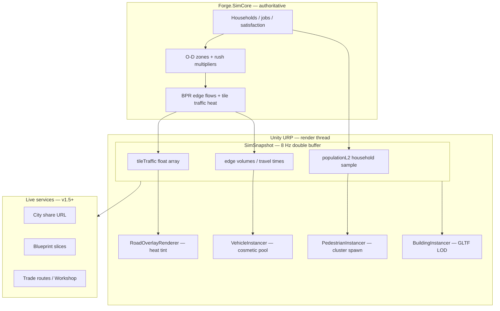

# CityMajor — City Ecosystem Vision

**Status:** Design north star  
**Date:** 2026-07-12  
**Audience:** Product, engineering, art  
**Linear:** [SB-4182](https://linear.app/softblaze/issue/SB-4182) (social/UGC) · [SB-4170](https://linear.app/softblaze/issue/SB-4170) (Unity v1) · [Canonical Roadmap](https://linear.app/softblaze/document/citymajor-canonical-roadmap-v1-full-vision-eb7277adafd0)

**Related:** [`MASTER_GAME_CONCEPT.md`](./MASTER_GAME_CONCEPT.md) · [`SIMULATION_ARCHITECTURE.md`](./SIMULATION_ARCHITECTURE.md) §4 + §16 · [`UNITY_V1_SCOPE.md`](./UNITY_V1_SCOPE.md) · [`VISUAL_QUALITY_GUIDE.md`](./VISUAL_QUALITY_GUIDE.md) (traffic feel research)

---

## 1. North star

CityMajor should feel like a **real SimCity session**: a city that is **alive**, **readable**, and **consequential**.

The player zones a corridor, lays roads, funds transit — and **sees** the result: rush-hour swell, buses on arterials, pedestrians around shops, industrial freight at dawn, Herald headlines that match what is on screen. The city is not a static diorama; it is a **lively ecosystem** of people, vehicles, jobs, and trade.

Three inseparable layers:

| Layer | Question it answers | Player emotion |
|-------|---------------------|----------------|
| **Simulation truth** | Is the economy/traffic/population model coherent? | “My decisions matter.” |
| **Visual life** | Does the city *look* busy and human at every zoom? | “This place is real.” |
| **Social ecosystem** | Can I share, compare, trade, and reuse what others built? | “My city exists in a world.” |

Unity v1 must nail **layers 1 + 2** for a modern-era mayor loop. Layer 3 ships in v1.5→v2.5 ([SB-4183](https://linear.app/softblaze/issue/SB-4183)–[SB-4186](https://linear.app/softblaze/issue/SB-4186)).

---

## 2. What “SimCity feeling” means (concrete)

Borrow the **feedback loops** that make classic city builders satisfying — not CS2’s graphics budget.

### Must-have sensations

1. **Demand → growth → traffic** — Paint residential where R-bar is high; watch infill; commute pressure rises on the nearest arterial. RCI meters are not decoration.
2. **Flow vs. jam** — Smooth movement at off-peak; visible bunching and slowdown when v/c crosses ~0.85. Fixing a bottleneck *looks* like fixing a bottleneck.
3. **People at street scale** — Zoom in: dots or silhouettes near commercial cores, transit stops, parks. Not every tile — **clusters** where attraction is high.
4. **District character** — Downtown glows with activity; suburbs quiet at night; industrial has truck rhythm. Same sim, different *density profiles* per zone type.
5. **Time rhythm** — Morning and evening peaks; softer midday; optional night lighting. The clock drives spawn rates, not just the HUD date.
6. **Herald grounded in sight** — “Gridlock on 4th Avenue” only when the traffic overlay and vehicle speeds agree.

### Explicit non-goals for v1

- Photorealistic cars, pedestrians with skeletal animation, or agent-based traffic (see §5).
- 100K named citizens on screen — v1 targets **~10K households**, **80–150 cosmetic vehicles**, **~200 pedestrian instances** at street zoom ([`UNITY_V1_SCOPE.md`](./UNITY_V1_SCOPE.md)).
- Multiplayer-visible life — deferred to v2 co-op.

---

## 3. Architecture: truth first, cosmetics second

`Forge.SimCore` already separates **macroscopic traffic** (BPR / Frank-Wolfe on zone graph) from **cosmetic vehicles** ([`SIMULATION_ARCHITECTURE.md`](./SIMULATION_ARCHITECTURE.md) §4, §16). Unity must preserve that split.



**Golden rule:** Cosmetic vehicles and pedestrians **never** feed back into the sim. They **sample** flows and household locations already computed by BPR and `PopulationSystem`.

---

## 4. Traffic — the busiest street in town

### 4.1 Simulation (already in stack)

| Component | Status | Notes |
|-----------|--------|-------|
| `WasmTrafficLite` / BPR-lite | ✅ in SimWasm path | 64-zone Frank-Wolfe; 5s cadence |
| `RoadOverlayRenderer` | ✅ Unity | Grey/orange tile heat from `SimSnapshot.TileTraffic` |
| Full BPR edge graph | 🟡 partial | Spec in `SIMULATION_ARCHITECTURE.md`; v1 can stay lite |
| Rush-hour multipliers | 🟡 design | Tie to sim clock: ~3× trip generation 7–9, 17–19 |

### 4.2 Visual layer (Unity v1 → v1.5)

Target: **Mini Motorways clarity** + **CS volume at city zoom** — smooth motion, type color-coding, density swings ([`VISUAL_QUALITY_GUIDE.md`](./VISUAL_QUALITY_GUIDE.md) §1).

| Element | v1 minimum | v1.5 polish |
|---------|------------|-------------|
| Road heat overlay | ✅ shipped | Pulse on new congestion |
| Cosmetic vehicles | **Pool 80–150** instanced meshes or billboards | 6–8 types (car, bus, truck, van, emergency) |
| Speed | From edge `TravelTime` / free-flow ratio | Visible bunching when v/c > 0.9 |
| Spawn rate | Proportional to adjacent edge `Volume` | Rush-hour multiplier from sim |
| Direction | 8-way or 4-way isometric | Lane-consistent paths along road graph |
| Audio | Optional stub | Flow hum vs. horn layer on congestion |
| Transit | — | Buses on fixed routes; visible boarding zones |

**Implementation sketch (Unity):**

- New `VehicleInstancer` — same pattern as `BuildingInstancer`: pooled `DrawMeshInstanced`, no per-vehicle `GameObject`.
- Path source: sample top-K edges by volume each frame; spawn/recycle vehicles along edge polylines.
- `CitySimBridge` exposes `TileTraffic`, edge list (when exported), sim hour for rush curve.

### 4.3 Acceptance — “traffic feels real”

- [ ] Painting a road that connects a residential blob to a job center **visibly** increases movement on that corridor within 2 in-game days.
- [ ] Removing a bottleneck (wider road, alternate route) **visibly** restores smooth flow before approval recovers.
- [ ] Rush hour produces **≥2×** vehicle count vs. off-peak on the same network.
- [ ] Herald `traffic_congestion` events align with overlay red zones ([`NarrativeTemplates.cs`](../../unity/CityMajor.Unity/Assets/Scripts/Net/NarrativeTemplates.cs)).

---

## 5. People — real population, readable crowds

### 5.1 Simulation

| Data | Source | v1 target |
|------|--------|-----------|
| Household count | `PopulationSystem` | ~10K |
| Satisfaction / commute | Per-household L2 | Top-N sample in snapshot |
| Citizen drill-down | `CitizenPanel` (web) | Port to Unity UI Toolkit v1.5 |
| Cultural DNA / factions | Full sim | Herald + approval only in v1 |

`PopulationSystem` already exports L2 household rows for web ([`population-l2.ts`](../../web/lib/population-l2.ts)). Unity should consume the same snapshot fields.

### 5.2 Visual layer

| Zoom band | What the player sees |
|-----------|----------------------|
| **City** (default) | Building instancing + road heat; **no** citizen spam |
| **District** | Instanced **citizen dots** on residential/commercial tiles (1 dot ≈ N households) |
| **Street** | **Pedestrian clusters** near `com_*` / `svc_*` footprints, parks, transit stops |

Rules:

- Spawn pedestrians where **attraction × foot traffic** exceeds threshold — not uniformly.
- Dots are pickable → open citizen/household panel (tile drill-down).
- Happiness tint: neutral → warm (happy) / cool (stressed) at dot color.

**Performance:** Cap ~200 pedestrian instances; recycle like vehicles. Use single mesh + color buffer.

### 5.3 Acceptance — “people feel real”

- [ ] Commercial cores show higher pedestrian density than empty industrial yards.
- [ ] Clicking a citizen dot opens stats consistent with sim (happiness, commute).
- [ ] Population growth wave visible as new dots/infills over weeks, not instant teleport.

---

## 6. Ecosystem aesthetics — great-looking alive city

Life is more than cars and dots.

### 6.1 Buildings & districts

- **Meshy modern GLTF kits** — silhouette variety at city zoom ([`GltfCatalog.cs`](../../unity/CityMajor.Unity/Assets/Scripts/Rendering/GltfCatalog.cs)).
- **Growth feedback** — staged infill (foundation → mid-rise → final mesh) over N ticks; avoids SimCity 4-style pop-in.
- **Night emissive** — window grids on `res_*_modern_*` / `com_*`; industrial subtle smoke stacks.
- **Service radii** — soft ground decals for police/hospital/park coverage (toggle in tools menu).

### 6.2 Ambient motion (cheap wins)

| Effect | Cost | Impact |
|--------|------|--------|
| Tree sway / park benches | Shader or static | ★★☆ |
| Construction cranes on growing tiles | 1 instanced prop | ★★★ |
| Smoke/steam particles at `ind_*` | GPU particles, capped | ★★★ |
| Cloud shadow scrolling | Single quad | ★★☆ |
| Time-of-day color grade | URP volume | ★★★★ |

### 6.3 Audio (v1.5)

- Layered ambient: city hum, traffic bed, bird layer in parks.
- Dynamic mix: congestion raises traffic bed + short horn stingers; high approval adds brighter tone.

---

## 7. Social ecosystem — cities in a connected world

Long-term moat: **your city is an asset others can visit, learn from, and trade with.**

Phasing (Linear):

| Phase | Feature | Issue |
|-------|---------|-------|
| **v1** | Local CMJR save; single-player life layers | [SB-4179](https://linear.app/softblaze/issue/SB-4179) |
| **v1.5** | Share city via URL; read-only spectator + Herald digest | [SB-4183](https://linear.app/softblaze/issue/SB-4183) |
| **v2** | NPC regional trade; co-op same city | [SB-4185](https://linear.app/softblaze/issue/SB-4185) · [SB-3728](https://linear.app/softblaze/issue/SB-3728) |
| **v2.5** | Blueprint export/import; Steam Workshop | [SB-4184](https://linear.app/softblaze/issue/SB-4184) · [SB-4186](https://linear.app/softblaze/issue/SB-4186) |
| **v3** | Player cities on shared regional map | [SB-3729](https://linear.app/softblaze/issue/SB-3729) |

### 7.1 Blueprints (district DNA)

A **blueprint** is a portable slice of city DNA:

- Zone grid patch + road graph fragment + optional service markers
- Metadata: author, era tag (`modern`), RCI mix, estimated capacity
- Format: CMJR chunk `0x02` **BlueprintSlice** ([SB-4184](https://linear.app/softblaze/issue/SB-4184))

Use cases: share a transit-oriented block, clone a highway interchange, sell a “glass tower cluster” on Workshop.

### 7.2 Trade as ecosystem glue

- **v2 NPC routes** — specialize (ore town ↔ your industrial park) per `TradeSystem.PartnerCityId`
- **v2.5 async P2P** — offer surplus goods; Herald narrates deals ([`MASTER_GAME_CONCEPT.md`](./MASTER_GAME_CONCEPT.md) LLM mayor negotiation)
- **Visual** — freight trucks weighted higher on trade routes; harbor/rail props when route active

### 7.3 Shareable city card

When sharing a city ([SB-4183](https://linear.app/softblaze/issue/SB-4183)), the card shows:

- Population, approval, budget health, RCI mix
- **Live thumbnail** — last snapshot render with traffic heat + night lights
- Herald pull-quote tied to active event

---

## 8. Phase roadmap — lively city + social

| Milestone | Simulation truth | Visual life | Social |
|-----------|------------------|-------------|--------|
| **Unity v1 EA** | RCI, budget, research, BPR heat, 10K HH | Road overlay ✅; buildings GLTF; **vehicle + pedestrian stubs OK as boxes** | Local CMJR |
| **Unity v1.1** | Rush-hour curve; L2 household export to Unity | **80–150 vehicles**; citizen dots; growth staging | — |
| **Unity v1.5** | Laws/services affect satisfaction visibly | Night lights, audio, construction props | City share URL |
| **v2** | Bilateral trade routes | Freight visual weight; regional map | Co-op + NPC trade |
| **v2.5** | — | Workshop blueprint previews | Blueprint economy |

**v1 ship bar:** Player can answer “why is my avenue jammed?” from **overlay + motion + Herald** without opening a spreadsheet.

---

## 9. SimSnapshot extensions (contract)

Fields Unity life renderers need (add to `SimSnapshot` / DTO when missing):

```csharp
// Proposed additions — names illustrative
float[] TileTraffic;           // ✅ exists — per-tile 0..1 heat
EdgeTrafficSample[] TopEdges;  // top K edges: from, to, volume, travelTime, freeFlowTime
byte SimHour;                  // 0–23 for rush curve
float RushMultiplier;          // 1.0 off-peak, ~3.0 peak
HouseholdPreview[] PopulationL2; // top N households: tile, happiness, commute
ushort ActiveVehicleBudget;    // max cosmetic spawns this frame (perf tier)
```

Export cadence: traffic heat @ sim tick; edge samples @ traffic lite tick (≤4 Hz); household sample @ day boundary.

---

## 10. Performance budget (Unity v1)

| Layer | Budget | Enforcement |
|-------|--------|-------------|
| Buildings | ~5K instanced, ≤40 draws/chunk | LOD + frustum cull ([`UNITY_V1_SCOPE.md`](./UNITY_V1_SCOPE.md)) |
| Vehicles | 80–150 instances | Pool + recycle; no pathfinding on render thread |
| Pedestrians | ≤200 instances | Cluster spawn only |
| Road overlay | 1 GL mesh pass | Reuse `RoadOverlayRenderer` |
| CPU sim | 8 Hz background thread | Never block render on sim |

If FPS < 30: drop pedestrian layer first, then vehicle count, never sim fidelity.

---

## Proposed Linear issues

| Title | Issue | Status |
|-------|-------|--------|
| `[Unity v1.1] Cosmetic vehicle instancer` | [SB-4188](https://linear.app/softblaze/issue/SB-4188) | 🟡 scaffold wired |
| `[Unity v1.1] Citizen dots + pedestrian clusters` | [SB-4187](https://linear.app/softblaze/issue/SB-4187) | 🟡 `PedestrianInstancer` + `CitizenPanel` (`C`) |
| `[Unity v1.1] Rush-hour traffic curve` | [SB-4189](https://linear.app/softblaze/issue/SB-4189) | 🟡 `Forge.SimWasm.LifeSimMath` shared |
| `[Unity v1.1] Service coverage overlay` | — | 🟡 `ServiceCoverageOverlay` toggle `V` |
| `[Unity v1.5] Time-of-day + ambient audio` | — | 🟡 `AmbientLifeController` + `AmbientAudioController` |
| `[Unity v1.5] Zone growth staging animation` | — | 🟡 `ZoneGrowthVisualizer` + `ConstructionPropInstancer` |
| `[Unity v1.5] City share spectator URL` | [SB-4183](https://linear.app/softblaze/issue/SB-4183) | 🟡 `CityShareStub` types only |
| `[Unity v2] Trade routes panel` | [SB-4185](https://linear.app/softblaze/issue/SB-4185) | 🟡 `TradeStripController` read-only (`E`) |
| `[Unity v2.5] Blueprint CMJR slice` | [SB-4184](https://linear.app/softblaze/issue/SB-4184) | 🟡 `BlueprintSlice` header stub |

Gate: [SB-4176](https://linear.app/softblaze/issue/SB-4176) Play verification before v1.1 ship.

---

## 11. Unity scaffold inventory (2026-07-12)

All cosmetic layers are wired in `CityMajorBootstrap` and sample `SimSnapshot` / `CitySimState` only — **no feedback into sim**.

| File | Layer |
|------|-------|
| `Rendering/VehicleInstancer.cs` | v1.1 traffic |
| `Rendering/PedestrianInstancer.cs` | v1.1 citizen dots |
| `Rendering/ZoneGrowthVisualizer.cs` | v1.5 growth staging |
| `Rendering/ConstructionPropInstancer.cs` | v1.5 construction |
| `Rendering/ServiceCoverageOverlay.cs` | v1.1+ services GL |
| `Rendering/AmbientLifeController.cs` | v1.5 time-of-day |
| `Audio/AmbientAudioController.cs` | v1.5 audio bed |
| `UI/CitizenPanelController.cs` | v1.1 L2 drill-down |
| `UI/TradeStripController.cs` | v2 trade stub |
| `UI/EventTickerController.cs` | v1.1 news ticker |
| `UI/DemandOverlayController.cs` | v1 RCI demand (bottom-center) |
| `UI/HappinessMeterController.cs` | v1 happiness left stack |
| `Input/BulldozeTool.cs` | v1 bulldoze (`X`) — zones + buildings + roads |
| `Platform/SteamBootstrap.cs` | Phase 3 Steam init + cloud/presence |
| `Platform/SteamAchievementTracker.cs` | v1 achievement unlock + toast |
| `UI/AchievementToastController.cs` | Top-center unlock popup |
| `Input/CitizenPickTool.cs` | v1.1 pick → panel |
| `Net/CityShareStub.cs` | v1.5 spectator URL |
| `Save/BlueprintSlice.cs` | v2.5 CMJR chunk 0x02 |
| `Platform/SteamWorkshopStub.cs` | v2.5 Workshop publish/subscribe (log-only) |
| `UI/BlueprintPanelController.cs` | v2.5 blueprint panel (`P`) |
| `UI/BlueprintPanel.uxml` | Blueprint panel layout |
| `Forge.SimWasm/LifeSimMath.cs` | Shared rush + happiness tint |
| `SimHost.GetPopulationL2()` | L2 export bridge |

---

## 12. Vision alignment check

| Principle | Aligned? | Notes |
|-----------|----------|-------|
| Deep sim, not arcade | ✅ | BPR truth drives cosmetics |
| Modern SimCity mayor fantasy | ✅ | RCI + roads + services + visible congestion |
| Herald as city voice | ✅ | Traffic + citizen events already templated |
| Social / trade / blueprints | ✅ | Phased; does not block v1 |
| “Great looking” | ✅ | GLTF + instancing + life layers — not AAA car models |
| Scope discipline | ✅ | v1.1 for vehicles/pedestrians; v1 ships heat + buildings |

**Risk:** Skipping cosmetic life and shipping “red tiles only” traffic — reads as tech demo, not SimCity. **Mitigation:** v1.1 immediately after Play gate; heat overlay in v1 is necessary but not sufficient.

---

## 13. Document hierarchy

```
CITY_ECOSYSTEM_VISION.md     ← THIS FILE: lively city + social north star
UNITY_V1_SCOPE.md            ← locked v1 parameters
SIMULATION_ARCHITECTURE.md   ← BPR + vehicle cosmetic spec
MASTER_GAME_CONCEPT.md       ← full 5-era + trade negotiation vision
CTO_IMPROVEMENT_ROADMAP_2026-07.md ← engineering phases
Linear Canonical Roadmap     ← issue mapping
```

---

*Authored 2026-07-12 on `feat/unity-port-plan-2026-07-12`. Revisit after SB-4176 Play verification and first Steam EA playtest.*
